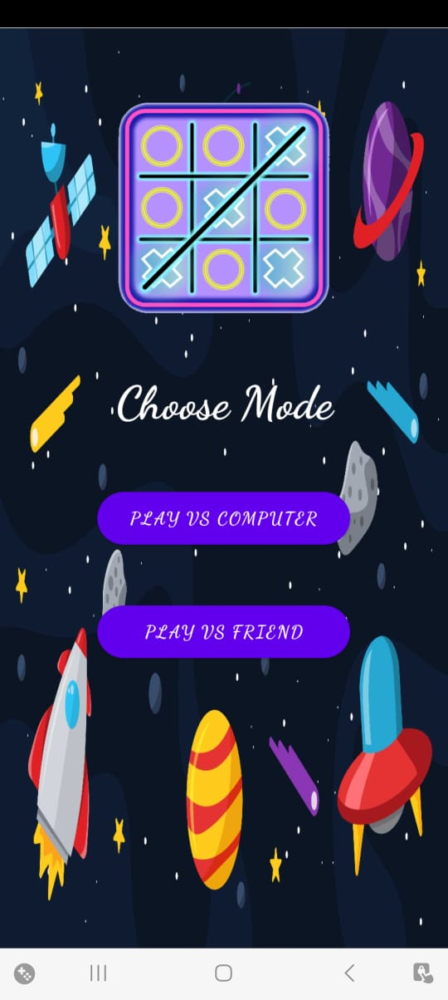
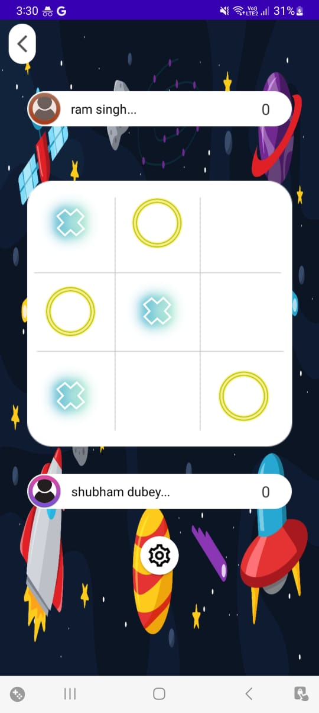
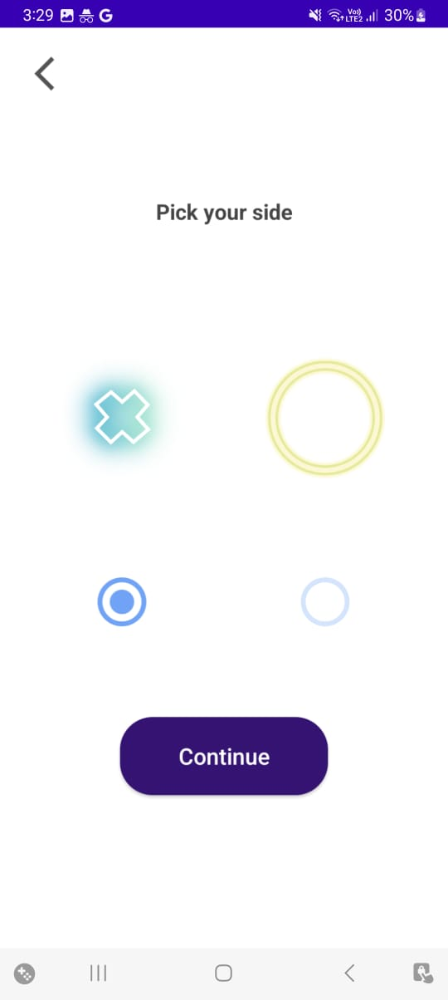
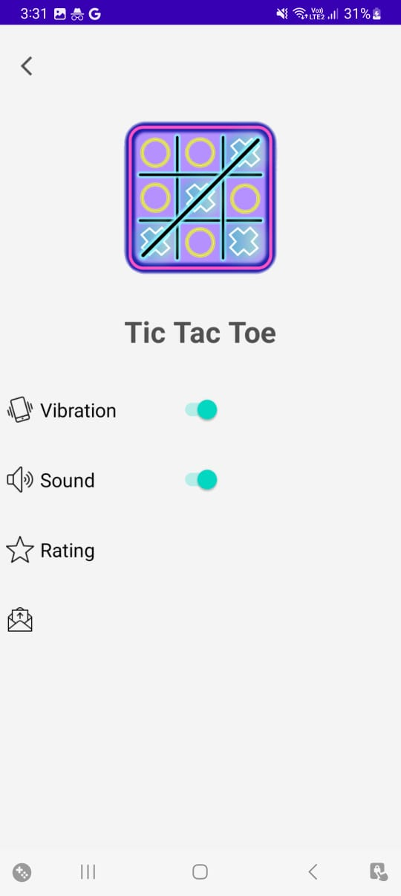
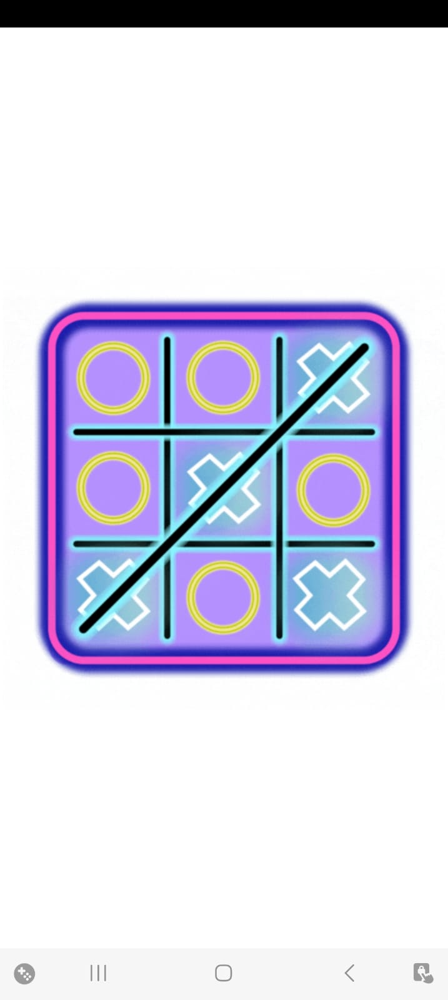

# Tic Tac Toe Game

## Introduction
This repository contains a tic tac toe game developed using Java in Android Studio. The game features a user-friendly interface with a sleek and intuitive design. It is integrated with sound and vibration effects, enhancing the gameplay experience. Additionally, players have the option to play against an AI opponent or challenge their friends.

## Features
- **User Interface**: The game boasts a visually appealing and user-friendly interface that provides a seamless gaming experience.
- **Sound and Vibration**: Enjoy an immersive experience with sound effects that enhance gameplay, along with vibration feedback for interactions.
- **Single Player Mode**: Test your skills against an AI opponent, providing a challenging gaming experience.
- **Multiplayer Mode**: Play with your friends in the multiplayer mode, adding an element of fun and competition.
- **Gameplay Mechanics**: The game follows the classic tic tac toe rules, ensuring familiarity and engaging gameplay.
- **Intuitive Controls**: The controls are designed to be intuitive, allowing players to easily place their marks and navigate the game.

## Installation
To run the tic tac toe game on your Android device, follow these steps:
1. Clone the repository: `git clone https://github.com/subhampramoddubey/TicTacToe`
2. Open the project in Android Studio.
3. Connect your Android device to your computer.
4. Build and run the project on your device from Android Studio.
5. Enjoy playing tic tac toe!

## Usage
Upon launching the game, you will be presented with the main menu, where you can choose between single player and multiplayer modes. In single player mode, you can select the difficulty level of the AI opponent. In multiplayer mode, you can connect with a friend to play on the same device.

During gameplay, simply tap on the desired cell to place your mark. The game will automatically detect the winner or a draw and display the result. Sound and vibration effects will further enhance your experience throughout the game.

## Screenshots

## Contributing
Contributions to the tic tac toe game are welcome! If you find any bugs or have suggestions for improvements, please open an issue or submit a pull request. Together, we can enhance the game and make it even more enjoyable for everyone.

## License
The tic tac toe game is released under the [MIT License](LICENSE.md). Feel free to use, modify, and distribute the code as per the terms of the license.

## Acknowledgements
I would like to express my gratitude to the following resources and libraries that were utilized in developing this game:
- [Android Studio](https://developer.android.com/studio)
- [Java](https://www.java.com/)
- [SoundPool](https://developer.android.com/reference/android/media/SoundPool)
- [Vibrator](https://developer.android.com/reference/android/os/Vibrator)

Thank you for considering this tic tac toe game! If you have any questions or feedback, please feel free to contact me. Happy gaming!
